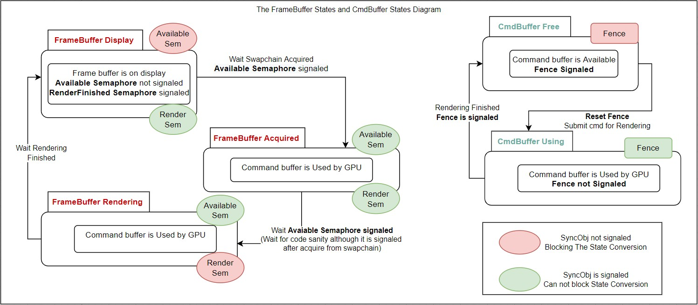

# VulkanTutorialInOOStyle
My vulkan learning record following Vulkan Tutorial https://vulkan-tutorial.com/

To make the source code more organized, this project uses OO style to make it more readable
and more module splitted.

## The drawing states and SyncObj relation ships

## Project On VS
Besides, this is totally a VS project, easy for downloading and start up.
